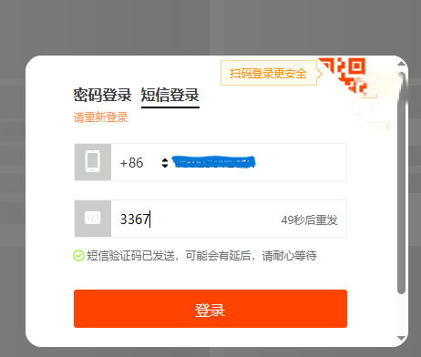
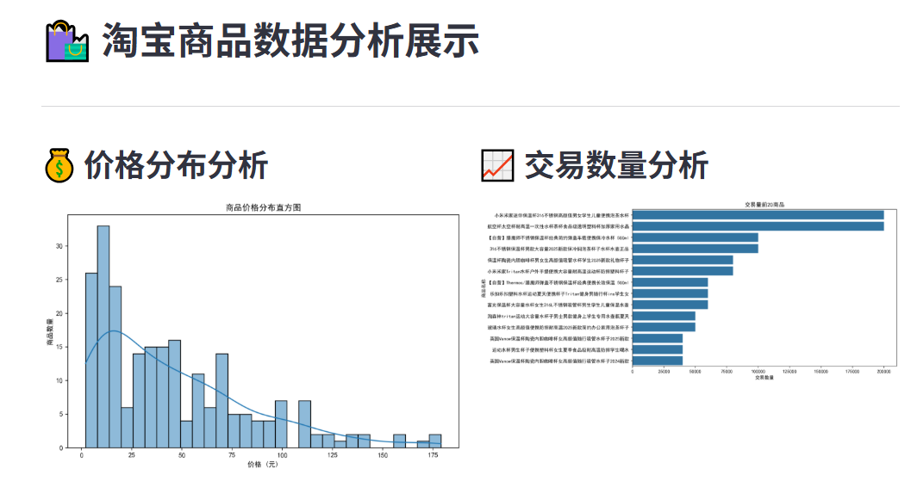

# 淘宝数据爬取与可视化项目

本项目旨在通过selenium模拟真实的用户访问taobao网站，绕过登录限制和反爬策略，爬取商品信息等数据。并对数据进行清洗和分析，以图表方式展现出来。

## 项目结构

- `scrape_taobao.py`: 负责数据爬取、清洗和保存
- `dashboard.py`: 负责数据可视化展示

## 主要功能

### 1. 数据爬取模块 (scrape_taobao.py)

该模块主要完成以下任务：

#### 手动登入并输入验证码



#### 数据爬取

使用自动化工具（如Selenium或Playwright）访问淘宝网站，搜索指定类别的商品。设置请求头，模拟用户页面滚动等操作，页面滚动操作确保所有商品都能被加载出来。
等待当前页面全部加载完后，再延时跳转到下一面。
主要代码实现：

```python
# 配置并初始化浏览器，设置开发者模式以绕过网站检测。
def init_browser():
    # 配置 Chrome 选项
    chrome_options = Options()
    chrome_options.accept_insecure_certs = True
    user_agent = '''Mozilla/5.0 (Windows NT 10.0; Win64; x64) AppleWebKit/537.36 (KHTML, like Gecko) Chrome/91.0.4472.124 Safari/537.36'''
    chrome_options.add_argument(f'user-agent={user_agent}')
    
    # 配置 Chrome 驱动路径
    chrome_driver = f'{current_directory}\\selenium_driver\\chromedriver.exe'
    service = Service(chrome_driver)
    browser = webdriver.Chrome(service=service, options=chrome_options)
    
    # 设置开发者模式，防止被检测
    browser.execute_cdp_cmd('Page.addScriptToEvaluateOnNewDocument', {
        'source': '''
            Object.defineProperty(navigator, 'webdriver', {
                get: () => undefined
            })
        '''
    })
    return browser
```

提取商品信息，包括但不限于：
- 商品标题
- 价格
- 销量
- 店铺信息
- 商品图片
- 交易数量
- 店铺所在地


#### 数据清洗和处理

对爬取的原始数据进行清洗和格式化：

```python
def clean_data(data):
    # 清理价格数据
    data['价格'] = data['价格'].astype(str).apply(lambda x: re.findall(r'\d+\.?\d*', x))
    data['价格'] = data['价格'].apply(lambda x: float(x[0]) if len(x) > 0 else 0)
    
    # 清理销量数据
    def extract_sales(sales_str):
        sales_str = str(sales_str)
        if '万' in sales_str:
            num = re.findall(r'\d+\.?\d*', sales_str)
            if num:
                return float(num[0]) * 10000
        else:
            num = re.findall(r'\d+', sales_str)
            if num:
                return float(num[0])
        return 0
    
    data['交易数量'] = data['交易数量'].apply(extract_sales)
    return data
```

#### 数据保存

将清洗后的数据保存到本地文件（如CSV或JSON格式），并下载商品图片：

```python
# 下载图片并自动检测WebP格式转换为JPEG

def download_image(image_url):
    try:
        # 处理相对URL
        if image_url.startswith('//'):
            image_url = 'https:' + image_url
        elif not image_url.startswith('http'):
            return None

        # 发送请求下载图片
        headers = {
            'User-Agent': 'Mozilla/5.0 (Windows NT 10.0; Win64; x64) AppleWebKit/537.36 (KHTML, like Gecko) Chrome/91.0.4472.124 Safari/537.36'
        }
        response = requests.get(image_url, headers=headers, timeout=10)
        response.raise_for_status()

        # 检查图片格式，如果是WebP则转换为JPEG
        image_data = BytesIO(response.content)
        try:
            image_pic = PILImage.open(image_data)
            if image_pic.format == 'WEBP':
                # 转换为JPEG格式
                image_pic = image_pic.convert('RGB')
                # 重新生成BytesIO对象
                converted_image_data = BytesIO()
                image_pic.save(converted_image_data, format='JPEG')
                # 重置指针位置
                converted_image_data.seek(0)
                # 使用转换后的数据
                image_data = converted_image_data
        except Exception as e:
            print(f'图片格式检查失败: {str(e)}')

        # 生成唯一文件名并保存
        filename = f'{uuid.uuid4()}.jpg'
        filepath = os.path.join(IMG_SAVE_DIR, filename)

        with open(filepath, 'wb') as f:
            f.write(image_data.getvalue())
        return filepath
    except Exception as e:
        print(f'图片下载失败: {str(e)}')
        return None
```

### 2. 数据展示模块 (dashboard.py)

该模块主要完成以下任务：

#### 数据加载与分析

```python
# 读取Excel数据
@st.cache_data
def load_data(file_path):
    df = pd.read_excel(file_path)
    # 数据清洗
    df = clean_price_data(df)
    df = clean_sales_data(df)
    df = extract_province_data(df)
    return df

# 提取省份数据

def extract_province_data(df):
    df['省份'] = df['店铺所在地'].astype(str).apply(lambda x: x.split()[0] if x else "未知")
    return df
```

#### 数据可视化

使用Streamlit和Seaborn创建交互式仪表板：

```python
def plot_price_distribution(df):
    """绘制价格分布图"""
    st.header("💰 价格分布分析")
    fig, ax = plt.subplots(figsize=(10, 6))
    sns.histplot(data=df, x='价格', bins=30, kde=True, ax=ax)
    ax.set_title('商品价格分布直方图')
    ax.set_xlabel('价格 (元)')
    ax.set_ylabel('商品数量')
    st.pyplot(fig)

# 绘制交易量前20商品图
def plot_top_sales(df):
    st.header("📈 交易数量分析")
    fig, ax = plt.subplots(figsize=(10, 6))
    # 取交易量前20的商品
    top_sales = df.nlargest(20, '交易数量')
    sns.barplot(data=top_sales, x='交易数量', y='商品简介', ax=ax)
    ax.set_title('交易量前20商品')
    ax.set_xlabel('交易数量')
    ax.set_ylabel('商品名称')
    st.pyplot(fig)
```



## 使用说明

1. 运行数据爬取脚本：

```bash
python scrape_taobao.py
```

1. 启动数据展示仪表板：

```bash
streamlit run dashboard.py
```
## python 3.11
### 需下载selenium模块使用的Chrome驱动:chromedriver.exe

## 依赖库

- Selenium 或 Playwright (用于网页自动化)
- Requests (用于图片下载)
- Pillow (用于图片处理)
- Pandas (用于数据处理)
- Streamlit (用于创建仪表板)
- Seaborn (用于数据可视化)
- PyECharts (用于地图展示)

## 注意事项

- 请遵守网站的robots.txt协议和使用条款
- 合理控制爬取频率，避免对网站造成过大压力
- 确保已安装所有必要的依赖库
- 根据需要配置图片保存路径和其他参数